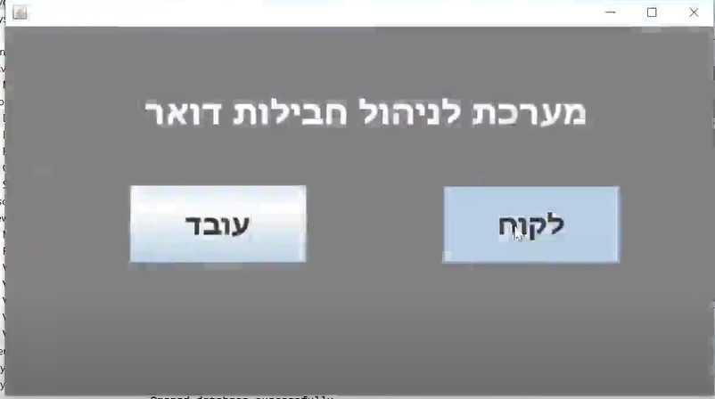
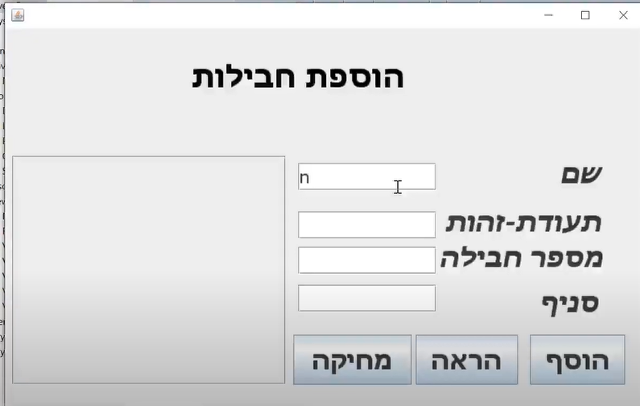
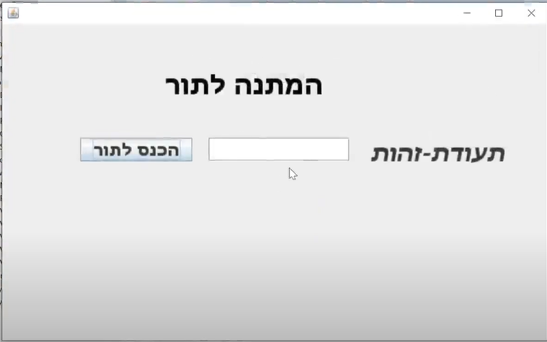
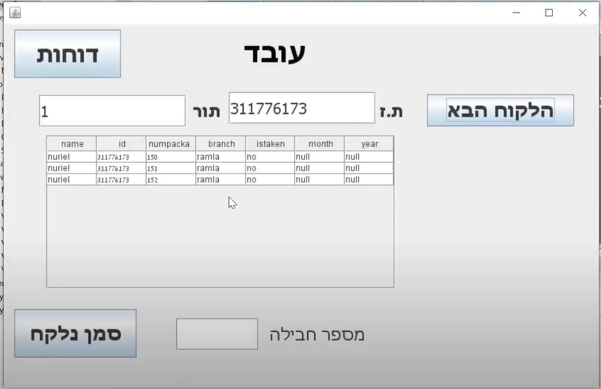
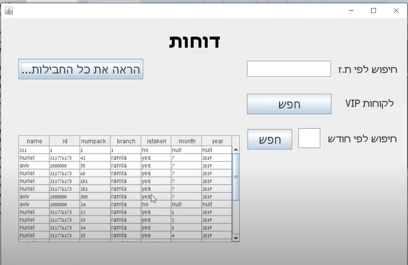

# Mail Delivery System

### Introduction 
This application is for a management package delivery system.  
It divided into 3 parts:  
1. Client side- the client request to pick up packages according to a specific branch and get line number when he arrives at the branch.  
2. Employee side- the employee gets line numbers and according to the numbers he can automatically see all the packages of the client.  
then he gives him the packages.  
3. Report- the employee can get statistical information on the packages.  

### Database 

SQLite

### Technology 
JAVA , Swing

### GIT
https://github.com/nuriel99/Mail_Delivery_System

### Youtube
https://youtu.be/3h-NdD8jQq0

 

